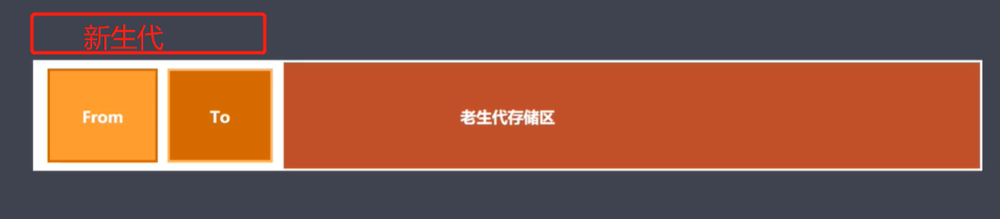
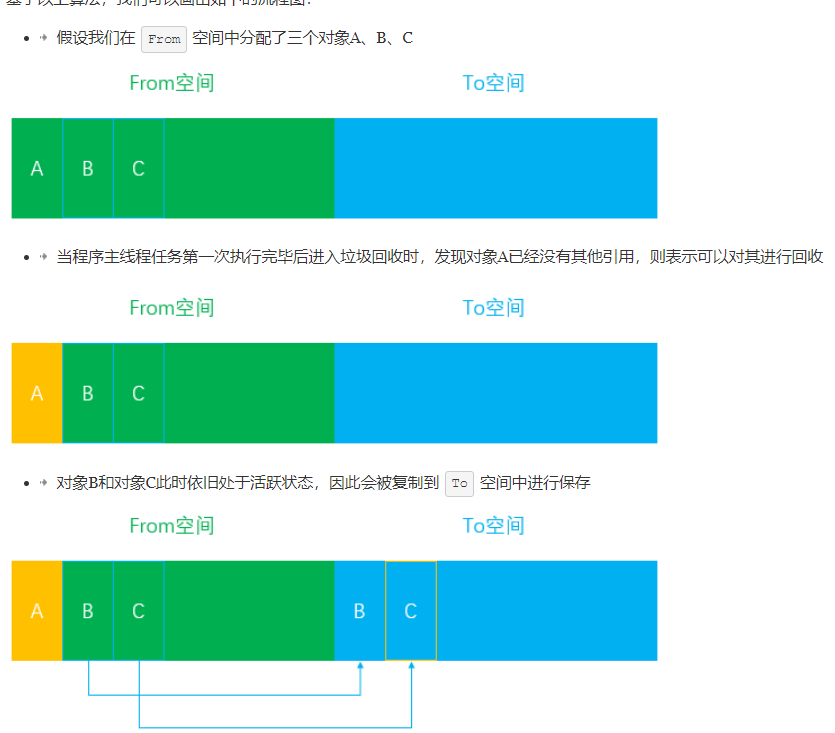
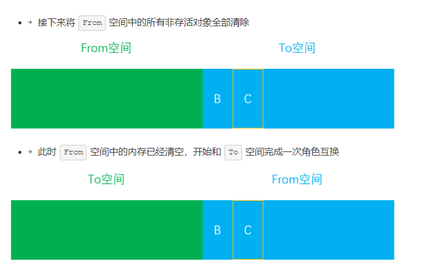
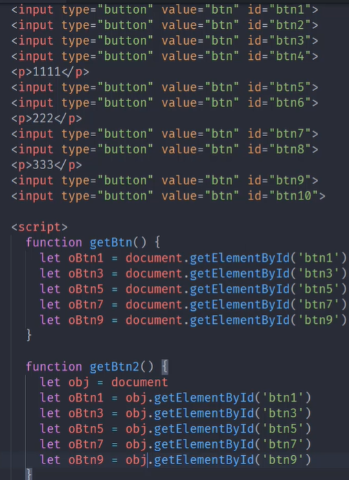
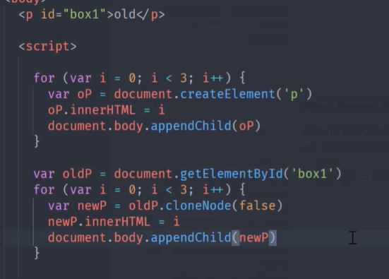

# 函数式编程
## 函数式编程与面向对象编程
### 函数式编程：（functional programming)(FP)
   - 将现实世界事物与事物之间额联系抽象到程序世界（对运算过程的抽象）
   - 程序的本质:根据输入通过某种运算活动相应的输出，程序开发过程中会涉及很多有输入与输出的函数
   - 函数式编程中的函数指的不是程序中的函数（方法），而是数学中的函数即映射关系，例如 y = sin(x), x 与y的关系
   - 相同的输入要有相同的输出
   - 函数式编程用来描述数据之间的映射
### 面向对象编程：（object oriented programming）(OOP)
   - 将现实世界中的事物抽象成程序世界的类和对象，通过封装继承 多态来演示事物之间的联系
   - 特点：
### 面向过程编程：（procedure oriented Programming）（POP）
   - 分析出解决问题所需要的步骤，然后用函数把这些步骤一步一步实现，使用的时候一个一个依次调用

### 函数式编程与面向对象编程的区别(计算机程序通常由两部分内容组成：数据和操作,在FP中，这两者通常由值和函数 来表示;在OOP中，我们把数据和操作定义在一个class中，通过类属性和类方法来表示)
   - 数据访问方式不一样
      + OOP:访问数据（全局变量除外），需要先获取对象的引用，然后在进行操作,所谓的对象其实就是函数式中的作用域
         所以也可以叫做作用域编程， 数据与操作逻辑合并到一起，形成一个封装
      + FP：访问是直接访问（通过函数入参或者作用域链查找），面向功能编程，函数可以访问的变量范围远远大于
         OOP，灵活性更高，但是OOP的约束性更强，本质是将数据与操作逻辑分开，然后各种组合

```
    //OOP
    class Foo {
        constructor() {
            this.bar = 0
        }
    }
    let foo = new Foo()
    foo.bar++
    //FP
    let bar = 0;
    function foo () {
        bar++
    }
    foo()
``` 

## 案例分析：

|          | 方法fn1    |  方法fn2  |  方法fn3  |
| -------- | -----:  | :----: | :----: |
| class1   |          |        |        |
| class2   |          |        |        |
| class3   |          |        |        |

### 目前我们使用面向对象与函数式编程分别实现以上功能
  - 面向对象编程：
    把 class1, class2, class3 抽象成了三个 class，然后分别给每个 class 加上 fn1, fn2, fn3 三个方法。这也是刚刚那句话的说法 面向对象编程把代码逻辑抽象成 class，然后给这些 class 一些操作，这里的主体是三个 class。
    + 面向对象编程是横向的填满了上的表格。
    + 在此可见OOP对问题的分解是由数据驱动的：它把问题分解成不同的由数据主导的类然后在类里面定义方法以实现需要的功能
  - 示例：
```
    class Father {
        fn1 () {

        }
        fn2 () {

        }
        fn3 () {

        }
    }
    class class1 extends Father {
        //重写父类方法
        fn1 () {

        }
        fn2 () {

        }
        fn3 () {

        }
    }
    class class2 extends Father {
        //重写父类方法
        fn1 () {

        }
        fn2 () {

        }
        fn3 () {

        }
    }
    class class3 extends Father {
        //重写父类方法
        fn1 () {

        }
        fn2 () {

        }
        fn3 () {

        }
    }
```
 - 函数式编程：
    这里的主体是三个操作，fn1, fn2 和 fn3，所以三个分别是一个函数，在函数里去实现三种变式怎么操作。
    + 函数式编程式纵向的填满了上面的表格。
    + FP对问题的分解是由操作驱动的，即把它分解成多个函数然后在函数内部分别处理不同的数据类型

 - 示例：

 ```
    fn1 (value) {
        switch(value)
            case class1: 代码块1;break;
            case class2: 代码块2;break;
            case class3: 代码块3;break;
                
    }
    fn2 (value) {
        switch(value)
            case class1: 代码块1;break;
            case class2: 代码块2;break;
            case class3: 代码块3;break;
                
    }
    fn3 (value) {
        switch(value)
            case class1: 代码块1;break;
            case class2: 代码块2;break;
            case class3: 代码块3;break;
                
    }
 ```
 ### 程序扩展比较：
   - 新增操作
        + FP:单独定义一个包含所有数据变种的的函数；
        + OOP:需要给每个类添加一个操作（需要修改所有的类）
   - 新增数据变种(class)
        + FP:需要给每个操作新增一个数据变种（需要修改所有有的操作）
        + OOP:根据新增的数据变种重新定义一个class
 ### 总结：
   - 函数式编程相当于按列填充这张表格，实现一个函数相当于把所有数据变种(variant)的同一操作都实现了
   - 面向对象式编程相当于按行填充，实现一个对象相当于把一个数据变种的所有不同操作都实现了。
   - 我们很难凭空地比较这两种不同编程范式地好坏，它们都是解决问题不同的正确的方式。就具体问题来说：如果我们有很多数据变种，少量的操作，函数式编程可能比较好些；反之则面相对象编程比较好些。

-----------------------------------------------------------------------------------
## 函数式编程相关
 - 函数是一等公民
    + 函数是一个对象
    + 函数可以存储在变量中（函数表达式）
    + 函数可以作为参数（高阶函数）
    + 函数可以作为返回值（高阶函数）

 - 闭包 （函数与周围的词法环境绑定在一起形成闭包）
 - 纯函数
### 副作用（副作用不可能完全禁止，但是可以尽可能控制在可控范围之内）
 - 函数在正常工作任务之外对外部环境所施加的影响。具体地说，函数副作用是指函数被调用，完成了函数既定的计算任务，但同时因为访问了外部数据，尤其是因为对外部数据进行了写操作，从而一定程度地改变了系统环境。
### 硬编码：数据直接嵌入到程序或其他可执行对象的源代码中的软件开发实践，与从外部获取数据或在运行时生成数据不同

-----------------------------------------------------------------------------------
## 函数式编程基础
 - 柯里化：
   + 将多元函数转化为一元函数 将fn（a, b, c） 转化为fn (a)(b)(c) 或者fn(a,b)(c)等，此三者的值等价
   + 柯里化可以让我们给一个函数传递较少的参数得到一个已经记住了某些固定参数的新函数；
   + 这是对函数参数的缓存
   + 让函数变得更灵活，颗粒更小
   + 可以把多元函数转换成一元函数，可以组合使用函数产生强大的功能
   ``` 
   示例：
   function curry (fn) {
       return function curryFn(...arg) {
           if (arg.length < fn.length) {
               return function () {
                   return curryFn(...arg.concat([...arguments]))
               }
           }
           retrun fn(...arg);
       }

   }
   ```
 - 纯函数：
   + 固定的输入一定有固定的输出
   + 不依赖外部数据
 - 组合函数/管道（组合函数与管道的区别在于管道从左往右，组合函数从右往左）
   + 如果一个函数需要经过多个函数处理才能得到最终值，这个时候可以把中间过程的函数合并成一个函数
```
示例：
    function compose(...arg) {
        return function (value) {
            arg.reduceRight((prev,curr) => {
                return curr(prev)
            }, value)
        }
    }
```
-----------------------------------------------------------------------------------
## PointFree
- Point Free：组合函数就是一种Point Free模式
- 我们可以把数据处理的过程定义成与数据无关的合成运算，不需要用到代表数据的那个参数，
- 只要把见到那的运算步骤合成到一起，在使用这种模式之前我们需要定义一些辅助的基本运算函数

- 不需要指明处理的数据
- 只需要合成运算过程
- 需要定义一些辅助的基本运算函数
## 函子（Functor）：一个特殊的容器，通过一个普通的对象来实现，该对象具有map方法，map方法可以运行一个函数对值进行处理（变形关系）
 - MayBe， Either， IO， Task， Monad， Pointed
 - 为什么要学：可以帮助我们在函数时编程中将副作用控制在可控范围内
 - 总计：
 - 函数式编程的运算不直接操作值，而是由函子完成
 - 函子就是一个实现了map契约的对象
 - 我们可以把函子想象成一个盒子，盒子内封装了一个值
 - 想要处理盒子中的值，我们需要给盒子的map方法传递一个处理值的函数（纯函数），由这个函数来处理值
 - 最终map返回一个包含新值的盒子（函子）

### Functor 函子
```
    class Container {
        constructor(value) {
            this._value = value
        }
        map(fn) {
            return new Container(fn(value))
        }
    }
```
### MayBe 函子 兼容空值
```
    class Maybe {
        constructor(value) {
            this._value = value
        }
        map(fn) {
            return this.isNothing ? new Container(null) : new Container(fn(value))
        }
        isNothing() {
            return this._value === null || this._value === undefined
        }
    }
```

### Either 函子（类似于if...else...） 异常处理
```
    class Left {
        constructor(value) {
            this._value = value
        }
        map(fn) {
            return this
        }
    }
    class Right {
        constructor(value) {
            this._value = value
        }
        map(fn) {
            return this.isNothing() ? new Right(null) : new Right(fn(value))
        }
        isNothing() {
            return this._value === null || this._value === undefined
        }
    }
    function ParseJson (str) {
        try {
            return new Right(JSON.parse(str))
        } catch (err){
            return new Left({err:err.message})
        }
    }

```
## IO函子 
 - IO函子中的_value是一个函数，这里把函数作为值来处理
 - IO函子可以把不纯的动作存储到_value中，延迟执行这个不纯的操作（惰性执行），包装当前的操作
 - 把不纯的操作交给调用者处理
```

const fp = require('lodash/fp')
const fs = require('fs')
class IO {
    static of(value) {
        return new IO(function () {
            return value
        })
    }
    constructor(fn) {
        this._value = fn;
    }
    map (fn) {
        return new IO(fp.flowRight(fn, this._value));
    }
}

let io = IO.of(process).map(p => p.execPath)

console.log(io._value())


//IO函子的问题 IO函子嵌套

let readFile = function (filename) {
    return new IO(function () {
        return fs.readFileSync(filename, 'utf-8')
    })
}

let print = function (x) {
    return new IO(function () {
        console.log(x);
        return x;
    })
}

let cat = fp.flowRight(print, readFile)
//IO { _value: [Function] }
let r = cat('./package.json')._value()._value()
// r : Io{
//    _value:function () {
//        return IO {
//            _value:function () {
//                return fs.readFileSync(filename, 'utf-8')
//            }
//        }
//    }
//}
console.log(r)
```
## POinted 函子 带有of静态方法的函子，of方法主要帮我们将一个值放入到一个容器中并且返回
```
    class Pointed {
        static of (value) {
            return new Pointed(value)
        }
        constructor(value) {
            this._value = value
        }
        map(fn) {
            return Pointed.of(fn(value))
        }
    }
```
## Monad 函子 （解决函子嵌套）
 - 可以变扁的Pointed函子
 - 一个函子如果具有join与of两个方法并且遵守一些定律就是一个Monad函子
```
class Monad {
    static of(value) {
        return new Monad(function () {
            return value
        })
    }
    constructor (fn) {
        this_value = fn
    }
    map(fn) {
        return new Monad(compose(fn, this._value))
    }
    join() {
        return this._value()
    }
    flatMap (fn) {
        return this.map(fn).join()
    }
}

let readFile = function (filename) {
    return new Monad(function () {
        return fs.readFileSync(filename, 'utf-8')
    })
}

let print = function (x) {
    return new Monad(function () {
        console.log(x);
        return x;
    })
}

)

readFile(pathname).flatMap(print).join()

```
## Task 函子 处理异步任务 - Folktale第三方库
```
  const fs = require('fs')
const {task} = require('folktale/concurrency/task')
const {split, find} = require('lodash/fp')
function readFile(filename) {
    return task(resolver => {
        fs.readFile(filename, 'utf-8', (err, data) => {
            if (err) return resolver.reject(err)
            resolver.resolve(data)
        })
    })
}

readFile('./package.json')
    .map(split('\n'))
    .map(find(x => x.includes('version')))
    .run()
    .listen({
        onRejected:err => {
            console.log(err)
        },
        onResolved:value => {
            console.log(value)
        }
    })  
```

# javscript的性能优化
## 垃圾回收/GC算法（垃圾收集器会按照固定的时间间隔（或代码执行中预定的收集时间）， 周期性地执行这一操作：找出那些不再继续使用的变量，然后释放其占用的内存。）
### 引用计数（V8不采用）
 - 核心思想：设置引用数，判断当前引用数是否为0，为0则回收，跟踪记录每个值被引用的次数
 - 优点：
    + 发现垃圾立即回收，最大程度减少程序暂停（时刻监控内存即将爆满，立即检查）(即刻回收垃圾，在更改引用时就知道该对象是否为垃圾若是垃圾立马进行回收(但是该操作会占用用户线程的时间片))
    + STW短，回收垃圾不需要遍历堆了
    + 不需要根据GC root遍历。
 - 缺点：无法回收循环引用的对象，资源开销大（引用计数器的操作）
 - 引用计数法每个对象都有一个引用计数器，当对象被引用一次，次数+1，引用失效次数-1，计数器数量为0意味着是垃圾对象，可以回收
 - 当垃圾回收器下一次运行时，就会释放那些引用次数为0的值所占用的内存。
 
### 标记清除
 - 实现原理：
    + 分标记与清除两个阶段
    + 找到活动对象并标记（与可达对象类似,垃圾回收器会在内部构建一个根列表，用于从根节点出发去寻找那些可以被访问到的变量。比如在JavaScript中，window全局对象可以看成一个根节点,垃圾回收器从所有根节点出发，遍历其可以访问到的子节点，并将其标记为活动的，根节点不能到达的地方即为非活动的，将会被视为垃圾）
    + 遍历所有对象寻找标记对象，清除无标记对象，并抹除标记，
    + 回收像相应空间
 - 优点：可以解决对象循环引用的问题
 - 缺点：空间碎片化，回收之后空闲空间地址不连续，不会立即回收垃圾对象，当需要分配一个大对象而空闲内存不足以分配，就会提前触发垃圾回收，实际上是不必要的因为实际上有空间只是不连续

### 标记整理
 - 可以看作标记清除的增强
 - 标记阶段操作与标记清楚相同
 - 清除之前会对对象位置进行整理，移动对象位置，让未标记对象的地址连续
 - 优点：减少碎片化空间
 - 缺点：不能立即回收垃圾对象
### 分代回收
 - 采用分代回收的思想
 - 内存分为新生代老生代
 - 针对不同对象采用不同算法

 

 #### 新生代对象存储区（64为32M, 32为16M）（空间换取时间）
 - 为什么采用这种算法：对于老生代内存来说，可能会存储大量对象，如果在老生代中使用这种算法，势必会造成内存资源的浪费，但是在新生代内存中，大部分对象的生命周期较短，在时间效率上表现可观，所以还是比较适合这种算法
 - 存活时间较短的对象（如局部作用域的对象）
 - 存储空间一分为二（from,to）== 等分
 - 回收过程采用复制算法 + 标记整理
 - 使用空间为from 空闲空间为to
 - 具体流程：具体实现中，它将新生代内存一分为二，也就是我们在上图中看见左边划分的两个区域，其中处于激活状态的区域我们称为From空间，未激活(inactive new space)的区域我们称为To空间。这两个空间中，始终只有一个处于使用状态，另一个处于闲置状态。我们的程序中声明的对象首先会被分配到From空间，当进行垃圾回收时，如果From空间中尚有存活对象，则会被复制到To空间进行保存，非存活的对象会被自动回收。当复制完成后，From空间和To空间完成一次角色互换，To空间会变为新的From空间，原来的From空间则变为To空间。
 - 示意图：
 
 
 - 在对活动对象进行拷贝时可能出现对象晋升（晋升为老生代）
   + 一轮GC之后还存在的新生代对象需要晋升
   + TO空间的使用率超过25%（之所以有25%的内存限制是因为To空间在经历过一次GC算法后会和From空间完成角色互换，会变为From空间，后续的内存分配都是在From空间中进行的，如果内存使用过高甚至溢出，则会影响后续对象的分配，因此超过这个限制之后对象会被直接转移到老生代来进行管理）
#### 老生代对象存储区（64为1.4G, 32为700M)
 - 回收过程采用标记清除 + 标记整理 + 增量标记
 - 首先使用标记清除完成垃圾空间的回收（老生代存储空间大暂不考虑空间，首先考虑速度）
 - 档把新生代的空间向老生代转移但是空间又不够，此时采用标记整理
 - 采用增量标记进行效率优化
   + 为什么采用增量标记：由于JS的单线程机制，垃圾回收的过程会阻碍主线程同步任务的执行，待执行完垃圾回收后才会再次恢复执行主任务的逻辑，这种行为被称为全停顿(stop-the-world)。在标记阶段同样会阻碍主线程的执行，一般来说，老生代会保存大量存活的对象，如果在标记阶段将整个堆内存遍历一遍，那么势必会造成严重的卡顿,因此，为了减少垃圾回收带来的停顿时间，V8引擎又引入了Incremental Marking(增量标记)的概念，即将原本需要一次性遍历堆内存的操作改为增量标记的方式，先标记堆内存中的一部分对象，然后暂停，将执行权重新交给JS主线程，待主线程任务执行完毕后再从原来暂停标记的地方继续标记，直到标记完整个堆内存。这个理念其实有点像React框架中的Fiber架构，只有在浏览器的空闲时间才会去遍历Fiber Tree执行对应的任务，否则延迟执行，尽可能少地影响主线程的任务，避免应用卡顿，提升应用性能。得益于增量标记的好处，V8引擎后续继续引入了延迟清理(lazy sweeping)和增量式整理(incremental compaction)，让清理和整理的过程也变成增量式的。同时为了充分利用多核CPU的性能，也将引入并行标记和并行清理，进一步地减少垃圾回收对主线程的影响，为应用提升更多的性能。

## 内存问题的外在体现:
 - 页面出现延迟加载或经常性暂停（频繁的垃圾回收）
 - 页面出现了持续性的糟糕的性能（内存膨胀），为了达到最优性能需要的内存超出设备所能提供
 - 页面的性能随着时间的加长越来越差（内存泄漏）
## 内存问题的查找方法
 - shift + esc 浏览器任务管理器 监控 内存是否频繁变化 
 - 控制台performance memory监控内存变化，根据timeLine查看是什么操作引起的
 - 控制台memory 堆快照（heap snapshot）查找分离DOM（搜索detached）

## 代码优化
 - 测试js性能 https://jsperf.com/ （在线测试）
 

 - 慎用全局变量：
   + 全局变量定义于全局执行上下文，是所有作用域的顶端，与局部变量相比查找时间消耗大
   + 全局变量定义于全局执行上下文，一直存在于上下文执行栈，直到程序退出，对于GC操作非常不利，因为一直存在
   + 某个局部作用域出现同名变量，会遮蔽或者污染全局
   ```
   //第二个性能更优
   var i, str = "";
    for (var i = 0; i< 1000; i++) {
        str+=i
        console.log(str)
        
    }
    for (let i = 0; i< 1000; i++) {
        let str = ''
        str+=i
        console.log(str)
    }
   ```
 - 缓存全局变量
   + 将使用中无法避免的全局变量缓存到局部
    
 - 通过原型新增方法
   + 在原型对象上新增实例对象需要的方法
  ```
    var fn1 = function () {
        this.foo = function () {
            console.log(1111)
        }
    }
    let f1 = new fn1()
    var fn2 = function () {
    }
    fn2.prototype.foo = function () {//性能更优
        console.log(1111)
    }
    let f21 = new fn2()
  ```
 - 避开闭包陷阱
   + 闭包很容易出现内存泄漏
   + 不要为了闭包而闭包
    
    ```
    function test (fun) {
        console.log(fun())
    }
    function test2 () {
        let name = 'lg'
        return name;
    }
    test(function () {//性能稍差
        let name = 'lg'
        return name;
    })
    test(test2) //性能更优
    ```
 - 避免属性访问方法使用
   + js中的面向对象不需要属性的访问方法，所有属性都是外部可见的
   + 使用属性访问方法只会增加一层重定义，没有访问的控制力
   ```
   function Person () {// 性能更低
       this.name = "lg";
       this.getName = function () {
           return this.name
       }
   }
   const pAge = new Person().getName()
   function Person1 () { //性能更高
       this.name = "lg";
   }
    const p2Age = new Person2().name;
   ```
- for循环的优化
    ```
    const arr=[]
    arr[10000] = "lh"
    for (var i = 0; i< arr.length; i++) {//性能更优，每次循环都要获取arr.length的值
        console.log(arr[i])
    }
    for (var i = arr.length; i; i--) { //性能更优
        console.log(arr[i])
    }

    ```
- 选择最优的循环方式
- 节点的优化操作
    + 文档碎片添加节点
    + 克隆优化节点操作:当有一个节点已经包含有部分属性，而需要的新增的节点与当前节点基本一致，可以使用克隆优化操作

- 直接量替换new Object
